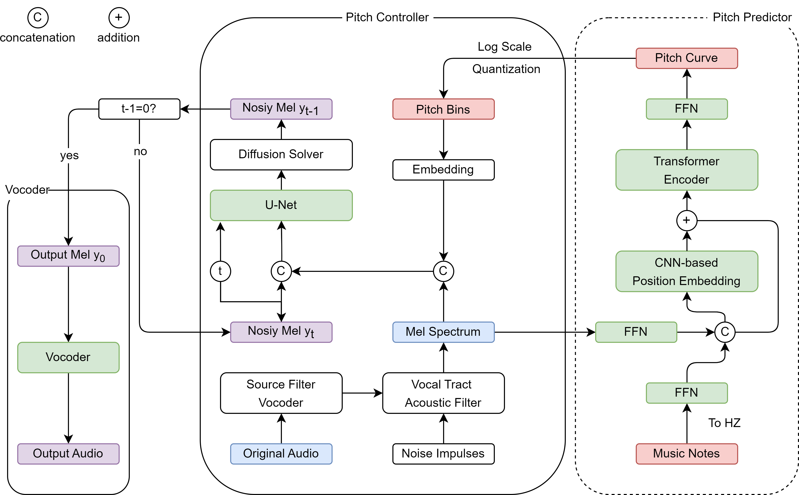

## Diff-Pitcher: Diffusion-based Pitch Correction for Singing Voice

### Framework

### Template-based Pitch Shifting Examples

Here are examples of template-based automatic pitch shifting where the pitch curve of a template audio is transferred to the out-of-tune audio.

#### sample 1

<table style='text-align: center;'>
  <tbody>
    <tr>
      <td>Out-of-tune audio</td>
      <td>Template audio</td>
    </tr>
    <tr>
        <td><audio controls="" style="width: 180px;height: 50px"><source src="samples/chinese/0_off.wav" type="audio/wav" /></audio></td>
        <td><audio controls="" style="width: 180px;height: 50px"><source src="samples/chinese/0_in.wav" type="audio/wav" /></audio></td>
    </tr>
  </tbody>
</table>

<table style='text-align: center;'>
  <tbody>
    <tr>
        <td><b>Diff-Pitcher-WORLD</b></td>
      <td>Diff-Pitcher-LPC</td>
      <td>SiFi-GAN</td>
      <td>WORLD Vocoder</td>
    </tr>
    <tr>
        <td><audio controls="" style="width: 180px;height: 50px"><source src="samples/diff_world/dw_c_f1_0.wav" type="audio/wav" /></audio></td>
        <td><audio controls="" style="width: 180px;height: 50px"><source src="samples/diff_lpc/c_f1_0_lpc.wav" type="audio/wav" /></audio></td>
        <td><audio controls="" style="width: 180px;height: 50px"><source src="samples/sifigan/c_f1_0_sifi.wav" type="audio/wav" /></audio></td>
        <td><audio controls="" style="width: 180px;height: 50px"><source src="samples/world/c_f1_0_pw.wav" type="audio/wav" /></audio></td>
    </tr>
  </tbody>
</table>

#### sample 2

<table style='text-align: center;'>
  <tbody>
    <tr>
      <td>Out-of-tune audio</td>
      <td>Template audio</td>
    </tr>
    <tr>
        <td><audio controls="" style="width: 180px;height: 50px"><source src="samples/chinese/1_off.wav" type="audio/wav" /></audio></td>
        <td><audio controls="" style="width: 180px;height: 50px"><source src="samples/chinese/1_in.wav" type="audio/wav" /></audio></td>
    </tr>
  </tbody>
</table>

<table style='text-align: center;'>
  <tbody>
    <tr>
        <td><b>Diff-Pitcher-WORLD</b></td>
      <td>Diff-Pitcher-LPC</td>
      <td>SiFi-GAN</td>
      <td>WORLD Vocoder</td>
    </tr>
    <tr>
        <td><audio controls="" style="width: 180px;height: 50px"><source src="samples/diff_world/dw_c_f3_4.wav" type="audio/wav" /></audio></td>
        <td><audio controls="" style="width: 180px;height: 50px"><source src="samples/diff_lpc/c_f3_4_lpc.wav" type="audio/wav" /></audio></td>
        <td><audio controls="" style="width: 180px;height: 50px"><source src="samples/sifigan/c_f3_4_sifi.wav" type="audio/wav" /></audio></td>
        <td><audio controls="" style="width: 180px;height: 50px"><source src="samples/world/c_f3_4_pw.wav" type="audio/wav" /></audio></td>
    </tr>
  </tbody>
</table>

#### sample 3

<table style='text-align: center;'>
  <tbody>
    <tr>
      <td>Out-of-tune audio</td>
      <td>Template audio</td>
    </tr>
    <tr>
        <td><audio controls="" style="width: 180px;height: 50px"><source src="samples/chinese/2_off.wav" type="audio/wav" /></audio></td>
        <td><audio controls="" style="width: 180px;height: 50px"><source src="samples/chinese/2_in.wav" type="audio/wav" /></audio></td>
    </tr>
  </tbody>
</table>

<table style='text-align: center;'>
  <tbody>
    <tr>
        <td><b>Diff-Pitcher-WORLD</b></td>
      <td>Diff-Pitcher-LPC</td>
      <td>SiFi-GAN</td>
      <td>WORLD Vocoder</td>
    </tr>
    <tr>
        <td><audio controls="" style="width: 180px;height: 50px"><source src="samples/diff_world/dw_c_m2_16.wav" type="audio/wav" /></audio></td>
        <td><audio controls="" style="width: 180px;height: 50px"><source src="samples/diff_lpc/c_m2_16_lpc.wav" type="audio/wav" /></audio></td>
        <td><audio controls="" style="width: 180px;height: 50px"><source src="samples/sifigan/c_m2_16_sifi.wav" type="audio/wav" /></audio></td>
        <td><audio controls="" style="width: 180px;height: 50px"><source src="samples/world/c_m2_16_pw.wav" type="audio/wav" /></audio></td>
    </tr>
  </tbody>
</table>

