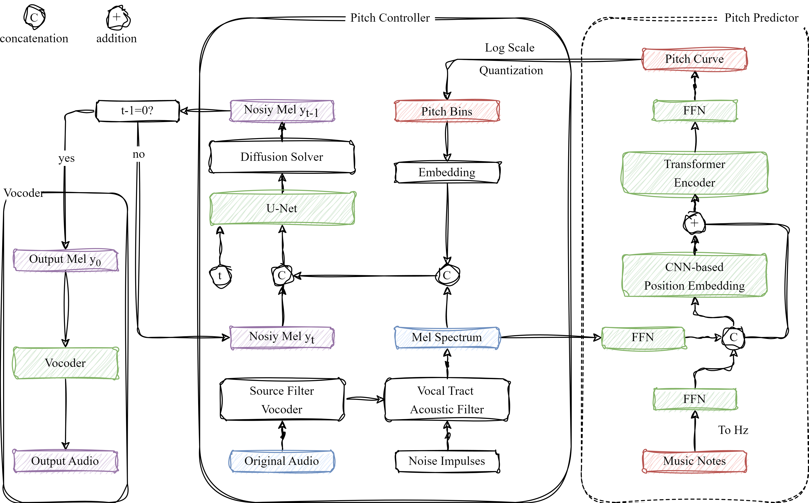
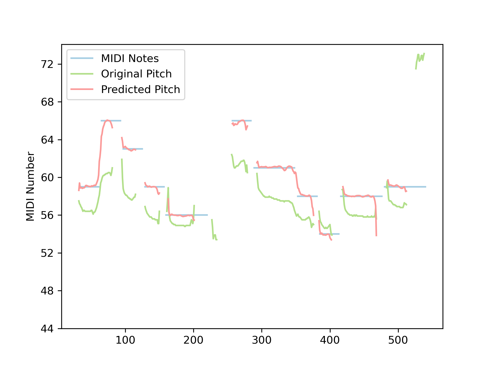
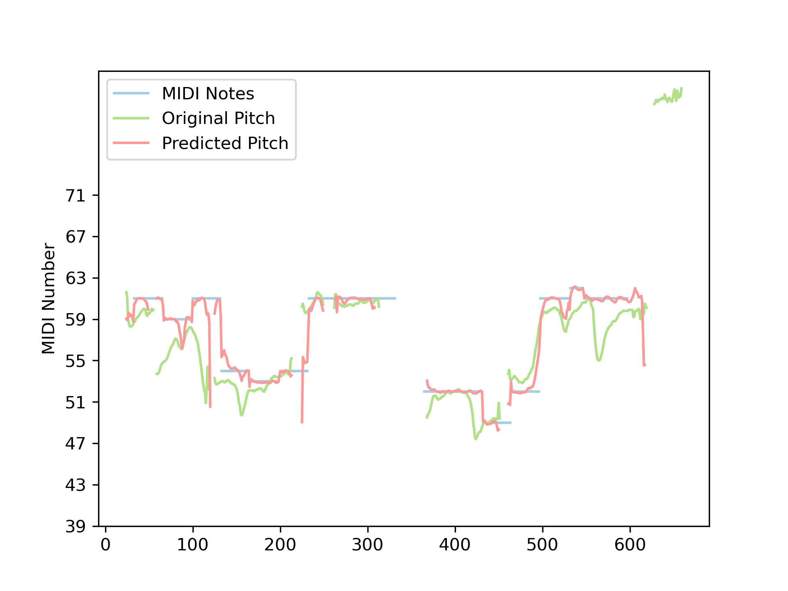

## Diff-Pitcher: Diffusion-based Pitch Correction for Singing Voice

### Framework

### Template-based Automatic Pitch Correction Examples

Here are examples of template-based automatic pitch correction where the pitch curve of a template audio is transferred to the out-of-tune audio. A Dynamic Time Warping algorithm based on MCEP is applied to further align template pitch curve and the target audio. 

<small>*The degree of off-key singing is notably higher in Chinese examples. Furthermore, these Chinese examples are recorded using mobile devices, mirroring the typical usage scenario of a karaoke app.</small>

#### Sample 1 (CH/Female)

<table style='text-align: center;' class="center">
  <tbody>
    <tr>
      <td>Out-of-tune audio</td>
      <td>Template audio</td>
    </tr>
    <tr>
        <td><audio controls="" style="width: 180px;height: 50px"><source src="samples/vocal_detune/c_f1_0.wav" type="audio/wav" /></audio></td>
        <td><audio controls="" style="width: 180px;height: 50px"><source src="samples/vocal/c_f1_0.wav" type="audio/wav" /></audio></td>
      </tr>
</tbody>
</table>

<table style='text-align: center;'>
  <tbody>
    <tr>
        <td><b>Diff-Pitcher-WORLD</b></td>
      <td>Diff-Pitcher-LPC</td>
      <td>SiFi-GAN</td>
      <td>WORLD Vocoder</td>
    </tr>
    <tr>
        <td><audio controls="" style="width: 180px;height: 50px"><source src="samples/diff_world/dw_c_f1_0.wav" type="audio/wav" /></audio></td>
        <td><audio controls="" style="width: 180px;height: 50px"><source src="samples/diff_lpc/c_f1_0_lpc.wav" type="audio/wav" /></audio></td>
        <td><audio controls="" style="width: 180px;height: 50px"><source src="samples/sifigan/c_f1_0_sifi.wav" type="audio/wav" /></audio></td>
        <td><audio controls="" style="width: 180px;height: 50px"><source src="samples/world/c_f1_0_pw.wav" type="audio/wav" /></audio></td>
      </tr>
</tbody>
</table>

#### Sample 2 (CH/Female)

<table style='text-align: center;'>
  <tbody>
    <tr>
      <td>Out-of-tune audio</td>
      <td>Template audio</td>
    </tr>
    <tr>
        <td><audio controls="" style="width: 180px;height: 50px"><source src="samples/vocal_detune/c_f3_4.wav" type="audio/wav" /></audio></td>
        <td><audio controls="" style="width: 180px;height: 50px"><source src="samples/vocal/c_f3_4.wav" type="audio/wav" /></audio></td>
      </tr>
</tbody>
</table>

<table style='text-align: center;'>
  <tbody>
    <tr>
        <td><b>Diff-Pitcher-WORLD</b></td>
      <td>Diff-Pitcher-LPC</td>
      <td>SiFi-GAN</td>
      <td>WORLD Vocoder</td>
    </tr>
    <tr>
        <td><audio controls="" style="width: 180px;height: 50px"><source src="samples/diff_world/dw_c_f3_4.wav" type="audio/wav" /></audio></td>
        <td><audio controls="" style="width: 180px;height: 50px"><source src="samples/diff_lpc/c_f3_4_lpc.wav" type="audio/wav" /></audio></td>
        <td><audio controls="" style="width: 180px;height: 50px"><source src="samples/sifigan/c_f3_4_sifi.wav" type="audio/wav" /></audio></td>
        <td><audio controls="" style="width: 180px;height: 50px"><source src="samples/world/c_f3_4_pw.wav" type="audio/wav" /></audio></td>
      </tr>
</tbody>
</table>

#### Sample 3 (CH/Male)

<table style='text-align: center;'>
  <tbody>
    <tr>
      <td>Out-of-tune audio</td>
      <td>Template audio</td>
    </tr>
    <tr>
        <td><audio controls="" style="width: 180px;height: 50px"><source src="samples/vocal_detune/c_m2_16.wav" type="audio/wav" /></audio></td>
        <td><audio controls="" style="width: 180px;height: 50px"><source src="samples/vocal/c_m2_16.wav" type="audio/wav" /></audio></td>
      </tr>
</tbody>
</table>

<table style='text-align: center;'>
  <tbody>
    <tr>
        <td><b>Diff-Pitcher-WORLD</b></td>
      <td>Diff-Pitcher-LPC</td>
      <td>SiFi-GAN</td>
      <td>WORLD Vocoder</td>
    </tr>
    <tr>
        <td><audio controls="" style="width: 180px;height: 50px"><source src="samples/diff_world/dw_c_m2_16.wav" type="audio/wav" /></audio></td>
        <td><audio controls="" style="width: 180px;height: 50px"><source src="samples/diff_lpc/c_m2_16_lpc.wav" type="audio/wav" /></audio></td>
        <td><audio controls="" style="width: 180px;height: 50px"><source src="samples/sifigan/c_m2_16_sifi.wav" type="audio/wav" /></audio></td>
        <td><audio controls="" style="width: 180px;height: 50px"><source src="samples/world/c_m2_16_pw.wav" type="audio/wav" /></audio></td>
      </tr>
      </tbody>
      </table>

#### Sample 4 (EN/Female)

<table style='text-align: center;'>
  <tbody>
    <tr>
      <td>Out-of-tune audio</td>
      <td>Template audio</td>
    </tr>
    <tr>
        <td><audio controls="" style="width: 180px;height: 50px"><source src="samples/vocal_detune/e_f2_5.wav" type="audio/wav" /></audio></td>
        <td><audio controls="" style="width: 180px;height: 50px"><source src="samples/vocal/e_f2_5.wav" type="audio/wav" /></audio></td>
      </tr>
</tbody>
</table>

<table style='text-align: center;'>
  <tbody>
    <tr>
        <td><b>Diff-Pitcher-WORLD</b></td>
      <td>Diff-Pitcher-LPC</td>
      <td>SiFi-GAN</td>
      <td>WORLD Vocoder</td>
    </tr>
    <tr>
        <td><audio controls="" style="width: 180px;height: 50px"><source src="samples/diff_world/dw_e_f2_5.wav" type="audio/wav" /></audio></td>
        <td><audio controls="" style="width: 180px;height: 50px"><source src="samples/diff_lpc/e_f2_5_lpc.wav" type="audio/wav" /></audio></td>
        <td><audio controls="" style="width: 180px;height: 50px"><source src="samples/sifigan/e_f2_5_sifi.wav" type="audio/wav" /></audio></td>
        <td><audio controls="" style="width: 180px;height: 50px"><source src="samples/world/e_f2_5_pw.wav" type="audio/wav" /></audio></td>
      </tr>
      </tbody>
      </table>

#### Sample 5 (EN/Female)

<table style='text-align: center;'>
  <tbody>
    <tr>
      <td>Out-of-tune audio</td>
      <td>Template audio</td>
    </tr>
    <tr>
        <td><audio controls="" style="width: 180px;height: 50px"><source src="samples/vocal_detune/e_f7_9.wav" type="audio/wav" /></audio></td>
        <td><audio controls="" style="width: 180px;height: 50px"><source src="samples/vocal/e_f7_9.wav" type="audio/wav" /></audio></td>
      </tr>
</tbody>
</table>

<table style='text-align: center;'>
  <tbody>
    <tr>
        <td><b>Diff-Pitcher-WORLD</b></td>
      <td>Diff-Pitcher-LPC</td>
      <td>SiFi-GAN</td>
      <td>WORLD Vocoder</td>
    </tr>
    <tr>
        <td><audio controls="" style="width: 180px;height: 50px"><source src="samples/diff_world/dw_e_f7_9.wav" type="audio/wav" /></audio></td>
        <td><audio controls="" style="width: 180px;height: 50px"><source src="samples/diff_lpc/e_f7_9_lpc.wav" type="audio/wav" /></audio></td>
        <td><audio controls="" style="width: 180px;height: 50px"><source src="samples/sifigan/e_f7_9_sifi.wav" type="audio/wav" /></audio></td>
        <td><audio controls="" style="width: 180px;height: 50px"><source src="samples/world/e_f7_9_pw.wav" type="audio/wav" /></audio></td>
      </tr>
      </tbody>
      </table>

#### Sample 6 (EN/Male)

<table style='text-align: center;'>
  <tbody>
    <tr>
      <td>Out-of-tune audio</td>
      <td>Template audio</td>
    </tr>
    <tr>
        <td><audio controls="" style="width: 180px;height: 50px"><source src="samples/vocal_detune/e_m4_1.wav" type="audio/wav" /></audio></td>
        <td><audio controls="" style="width: 180px;height: 50px"><source src="samples/vocal/e_m4_1.wav" type="audio/wav" /></audio></td>
      </tr>
</tbody>
</table>

<table style='text-align: center;'>
  <tbody>
    <tr>
        <td><b>Diff-Pitcher-WORLD</b></td>
      <td>Diff-Pitcher-LPC</td>
      <td>SiFi-GAN</td>
      <td>WORLD Vocoder</td>
    </tr>
    <tr>
        <td><audio controls="" style="width: 180px;height: 50px"><source src="samples/diff_world/dw_e_m4_1.wav" type="audio/wav" /></audio></td>
        <td><audio controls="" style="width: 180px;height: 50px"><source src="samples/diff_lpc/e_m4_1_lpc.wav" type="audio/wav" /></audio></td>
        <td><audio controls="" style="width: 180px;height: 50px"><source src="samples/sifigan/e_m4_1_sifi.wav" type="audio/wav" /></audio></td>
        <td><audio controls="" style="width: 180px;height: 50px"><source src="samples/world/e_m4_1_pw.wav" type="audio/wav" /></audio></td>
      </tr>
      </tbody>
      </table>

### Score-based Automatic Pitch Correction Examples

Here are examples of score-based automatic pitch correction where the pitch curve predicted by the pitch predictor is transferred to the out-of-tune audio. The pitch predictor takes MIDI notes and the vocal spectrum of the out-of-tune audio as inputs.

#### Sample 1 (CH/Female)

<table style='text-align: center;'>
  <tbody>
    <tr>
       
    </tr>
</tbody>
</table>

<table style='text-align: center;'>
  <tbody>
    <tr>
      <td>Out-of-tune audio</td>
      <td>MIDI Notes</td>
        <td><b>Tuned Audio</b></td>
    </tr>
    <tr>
        <td><audio controls="" style="width: 180px;height: 50px"><source src="samples/pitch_predictor/detuned/f1_0.wav" type="audio/wav" /></audio></td>
        <td><audio controls="" style="width: 180px;height: 50px"><source src="samples/pitch_predictor/midi/f1_0.wav" type="audio/wav" /></audio></td>
        <td><audio controls="" style="width: 180px;height: 50px"><source src="samples/pitch_predictor/tuned/f1_0.wav" type="audio/wav" /></audio></td>
    </tr>
</tbody>
</table>

#### Sample 2 (CH/Female)

<table style='text-align: center;'>
  <tbody>
    <tr>
      <td>Out-of-tune audio</td>
      <td>MIDI Notes</td>
        <td><b>Tuned Audio</b></td>
    </tr>
    <tr>
        <td><audio controls="" style="width: 180px;height: 50px"><source src="samples/pitch_predictor/detuned/f1_8.wav" type="audio/wav" /></audio></td>
        <td><audio controls="" style="width: 180px;height: 50px"><source src="samples/pitch_predictor/midi/f1_8.wav" type="audio/wav" /></audio></td>
        <td><audio controls="" style="width: 180px;height: 50px"><source src="samples/pitch_predictor/tuned/f1_8.wav" type="audio/wav" /></audio></td>
      </tr>
      <tr>
       
      </tr> 
</tbody>
</table>

#### Sample 3 (CH/Female)

<table style='text-align: center;'>
  <tbody>
    <tr>
      <td>Out-of-tune audio</td>
      <td>MIDI Notes</td>
        <td><b>Tuned Audio</b></td>
    </tr>
    <tr>
        <td><audio controls="" style="width: 180px;height: 50px"><source src="samples/pitch_predictor/detuned/f2_4.wav" type="audio/wav" /></audio></td>
        <td><audio controls="" style="width: 180px;height: 50px"><source src="samples/pitch_predictor/midi/f2_4.wav" type="audio/wav" /></audio></td>
        <td><audio controls="" style="width: 180px;height: 50px"><source src="samples/pitch_predictor/tuned/f2_4.wav" type="audio/wav" /></audio></td>
      </tr>
      <tr>
       
      </tr> 
</tbody>
</table>

#### Sample 4 (CH/Female)

<table style='text-align: center;'>
  <tbody>
    <tr>
      <td>Out-of-tune audio</td>
      <td>MIDI Notes</td>
        <td><b>Tuned Audio</b></td>
    </tr>
    <tr>
        <td><audio controls="" style="width: 180px;height: 50px"><source src="samples/pitch_predictor/detuned/f3_16.wav" type="audio/wav" /></audio></td>
        <td><audio controls="" style="width: 180px;height: 50px"><source src="samples/pitch_predictor/midi/f3_16.wav" type="audio/wav" /></audio></td>
        <td><audio controls="" style="width: 180px;height: 50px"><source src="samples/pitch_predictor/tuned/f3_16.wav" type="audio/wav" /></audio></td>
      </tr>
      <tr>
       
      </tr> 
</tbody>
</table>

#### Sample 5 (CH/Male)

<table style='text-align: center;'>
  <tbody>
    <tr>
      <td>Out-of-tune audio</td>
      <td>MIDI Notes</td>
        <td><b>Tuned Audio</b></td>
    </tr>
    <tr>
        <td><audio controls="" style="width: 180px;height: 50px"><source src="samples/pitch_predictor/detuned/m2_1.wav" type="audio/wav" /></audio></td>
        <td><audio controls="" style="width: 180px;height: 50px"><source src="samples/pitch_predictor/midi/m2_1.wav" type="audio/wav" /></audio></td>
        <td><audio controls="" style="width: 180px;height: 50px"><source src="samples/pitch_predictor/tuned/m2_1.wav" type="audio/wav" /></audio></td>
      </tr>
      <tr>
       
      </tr> 
</tbody>
</table>

#### Sample 6 (CH/Male)

<table style='text-align: center;'>
  <tbody>
    <tr>
      <td>Out-of-tune audio</td>
      <td>MIDI Notes</td>
        <td><b>Tuned Audio</b></td>
    </tr>
    <tr>
        <td><audio controls="" style="width: 180px;height: 50px"><source src="samples/pitch_predictor/detuned/m2_9.wav" type="audio/wav" /></audio></td>
        <td><audio controls="" style="width: 180px;height: 50px"><source src="samples/pitch_predictor/midi/m2_9.wav" type="audio/wav" /></audio></td>
        <td><audio controls="" style="width: 180px;height: 50px"><source src="samples/pitch_predictor/tuned/m2_9.wav" type="audio/wav" /></audio></td>
      </tr>
      <tr>
       
      </tr> 
</tbody>
</table>

